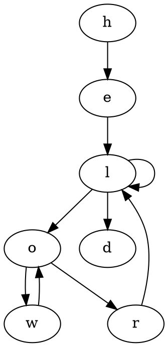
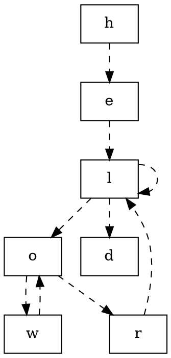
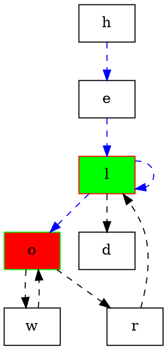
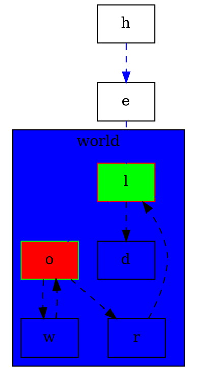

## graphviz

[graphviz](http://www.graphviz.org/)是一个非常棒的工具集，用于基于特殊文本数据的可视化，出自AT&T实验室。graphviz，包括了dot（有向图）、neato（spring-model图）、twopi（径向布局图）、circo（圆环布局）和fpd（无向图）。其中dot是默认的布局工具，也是应用最广泛的一个。有很多工具可以完成graphviz所提供的功能，或者可能效果更好，不过作为`geek`，我还是习惯于用最简单的方式处理工作。本文中，将介绍dot的基本用法，以及如何通过dot完成日常绘图需求。

需要说明的是，dot是一个DSL工具（画图语言），所以我们需要通过编写代码的方式来画图。

graphviz,由图、顶点和边三个元素组成。每个元素都有自己的属性，比如，形状，颜色、字体、大小，样式等等，这一切都可以在编写脚步的时候，进行设置。dot脚本的编写流程，如下：

1.定义一个`图`，并向图中添加`顶点`和`边`

2.设置图、顶点和边的属性（如，字体、样式、颜色等）

3.通过命令行工具引擎dot，绘制并导出脚步中定义的图


## 牛刀小试 

现在我们就来绘制一张最简单的图：

1.编辑以下内容，到helloword.gv文件中：



2.通过dot引擎绘图

```bash

dot -Tpng helloworld.gv -o helloworld.png
```

3.查看绘图效果(够漂亮吧)


其实，整个操作流程都非常简单，关键部分就是脚本的编写。我们就是按照"hello world"的字符顺序，画了一张简单的`有向图`。`图`（针对有向图的关键字是`digraph`）就是整个`{ }`中定义的对象内容，`顶点`(关键字为`node`，默认省略)显示的是`椭圆`(重复的顶点会被归并掉)，`边`（关键字是`edge`,也就是图中的`连线`符号），是每个顶点之间的连线。最后，箭头符号就表示方向。每个元素都是用默认的属性值，都是默认的黑色。表示顶点的圆圈中显示的文本，就是顶点的名称。graphviz图中的每个元素的属性都是可以显性的进行设置，下文中会进一步说明。另外，dot还支持pdf、svg等格式的输出，只需要通过`-T`参数指定即可，此处不再赘述。

__注意__： 脚本文件中每一行由`换行符`或`;`符号分割。可以使用简单句和复合句。如`a->b->c`等价于`a->b; b->c`。元素之间的空格符号是可选的，没有强制要求。


## 统一定制顶点和边的属性

现在我们通过编辑脚本，将顶点设置为长方形，将边定义为虚线。在脚本中增加，如下的内容：

```graphviz

node [shape="record"];
edge [style="dashed"];
```

将编辑后的脚本，保存为helloworld2.gv。具体内容，如下：



然后，重新生成图形文件。其效果，如下：


### 自由定制元素的属性


我们可以根据实际需要，挨个定制不同元素的属性。如，我们修改`l`顶点的属性为`填充`样式，边框颜色为`红色`,填充色为`绿色`。
而`o`顶点的属性刚好和`l`相反（都为填充样式之外）；同时，将h到o上的所有边的设置为`蓝色`。将文件保存为helloworld3.gv，其具体内容，如下：



然后，重新生成图形文件。其效果，如下：


__注意__： 可以自定义顶点和边的属性，形式为在顶点和边的定义之后加上一个由`方括号括`起来的`key-value列表`，每个key-value对由`逗号`隔开。


### 绘制子图

graphviz支持子图的绘制。子图的关键子是`subgraph`。子图的名称，需要以关键字`cluster`开头，否则graphviz将无法识别子图。我尝试将`world`部分作为子图来绘制。将文件保存为helloworld4.gv具体内容，如下：（用label属性设置标签，bgcolor设置子图背景颜色）\



然后，重新生成图形文件。其效果，如下：

```bash

dot -Tpng finite_state_machine.gv -o finite_state_machine.png
```


## 扩展阅读

* [巧用Graphviz绘制状态机图](http://guiquanz.me/2013/01/21/draw-finite-state-machine-by-graphviz/)
* [巧用Graphviz和pvtrace等工具可视化C函数调用](http://guiquanz.me/2012/10/15/linux_c_call_trace/)
* [UML Use Case Diagrams & Graphviz](http://martin.elwin.com/blog/2008/05/uml-use-case-diagrams-graphviz/)
* [使用graphviz绘制流程图](http://icodeit.org/2012/01/%E4%BD%BF%E7%94%A8graphviz%E7%BB%98%E5%88%B6%E6%B5%81%E7%A8%8B%E5%9B%BE/)
* [使用 Graphviz 生成自动化系统图](http://www.ibm.com/developerworks/cn/aix/library/au-aix-graphviz/)
* [Graphviz - Graph Visualization Software](http://www.graphviz.org/)
* [UML Diagrams Using Graphviz Dot](http://www.ffnn.nl/pages/articles/media/uml-diagrams-using-graphviz-dot.php)
* [Drawing graphs with dot](http://www.graphviz.org/pdf/dotguide.pdf)
* [staruml](http://staruml.io/)
* [Family tree layout with Dot/GraphViz](http://stackoverflow.com/questions/2271704/family-tree-layout-with-dot-graphviz)
* [Enforcing horizontal node ordering in a .dot tree](http://stackoverflow.com/questions/10902745/enforcing-horizontal-node-ordering-in-a-dot-tree)
* [Generate a directory tree with dot](http://www.graphviz.org/content/generate-directory-tree-dot)
* [Visualizing binary trees with Graphviz](http://eli.thegreenplace.net/2009/11/23/visualizing-binary-trees-with-graphviz)
* [The Programmable Tree Drawing Engine](http://pythonhosted.org/ete2/tutorial/tutorial_drawing.html)
* [Netsniff - Design and Implementation Concepts](http://caia.swin.edu.au/reports/050204A/CAIA-TR-050204A.pdf)
* [Design and Implementation of Netdude, a Framework for Packet Trace Manipulation](http://netdude.sourceforge.net/doco/netdude-freenix2004/)
* [Intermediate states of the B-Tree](http://ysangkok.github.io/js-clrs-btree/btree.html)

## 祝大家玩的开心

## 编程之道，就在[编程之美]


